# Lab (JC-Session 5): Exploring Inheritance and Method Overrides
#### Author: Nicholo Pardines

# 1. Basic Inheritance
- Prediction: A
- Outcome: A

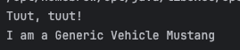
## Mini-Challenge (Inheritance)
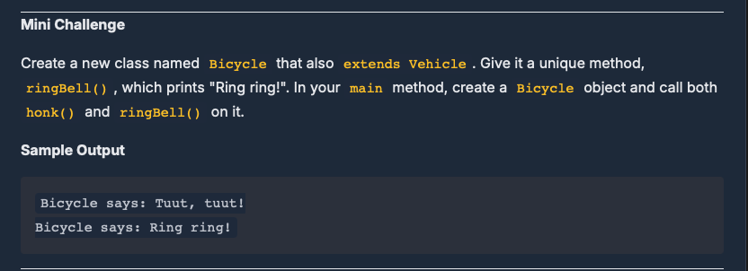
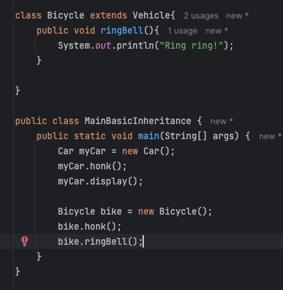
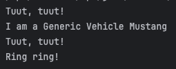

# 2. Abstract Classes
- Predicted: B
- Outcome: B

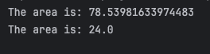
## Mini-Challenge (Abstract)
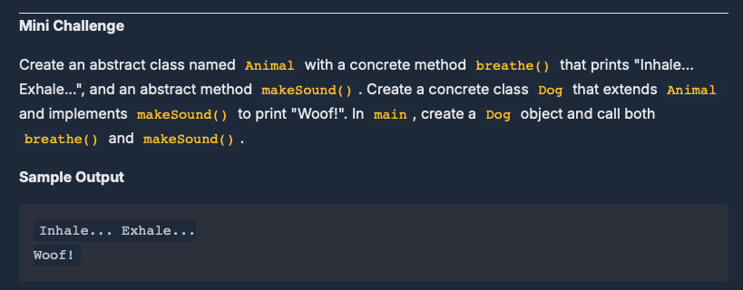
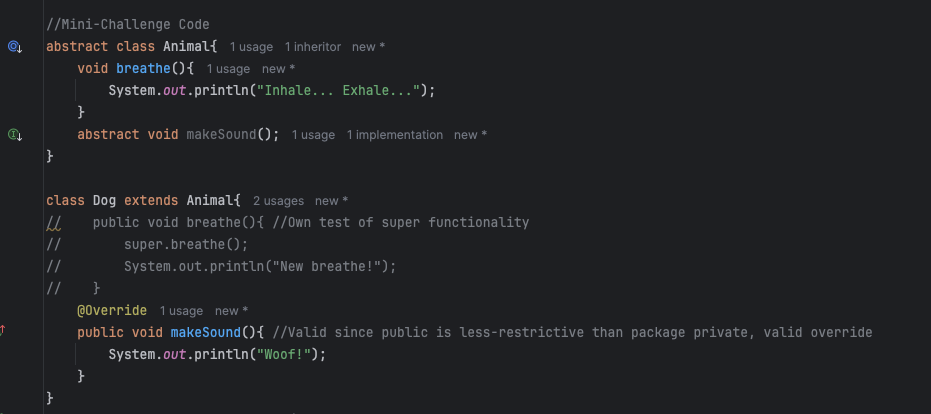
### in-main:
```java
Dog dog = new Dog();
dog.breathe();
dog.makeSound();
```
### output:
```text
Inhale... Exhale...
New breathe!
Woof!
```

# 3. Method Overriding: Providing a new Implementation
- Prediction: B
- Outcome: B (since all methods are non-static, the method called depends entirely on object type, not reference type)
  - Hence, the methods called are predictably correctly called
```text
--- Regular Editor ---
Opening a generic file.

--- Code Editor ---
Applying syntax highlighting...
Opening a generic file.

--- Polymorphic Editor ---
Applying syntax highlighting...
Opening a generic file.
```
## Mini-Challenge (Method Overriding)
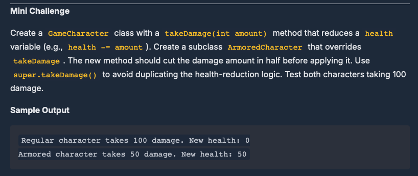
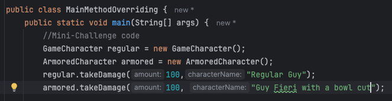
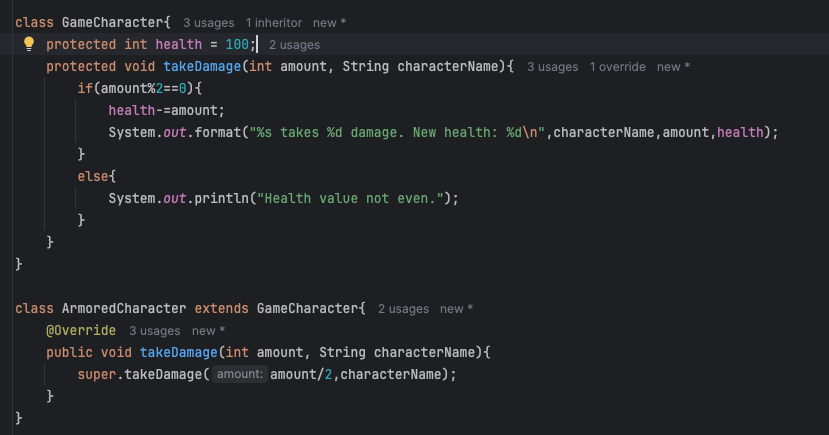
### Output
```text
Regular Guy takes 100 damage. New health: 0
Guy Fieri with a bowl cut takes 50 damage. New health: 50

Process finished with exit code 0
```

# 4. Inheriting Variables & Access Rules + Mini-Challenge
## Mini-Challenge
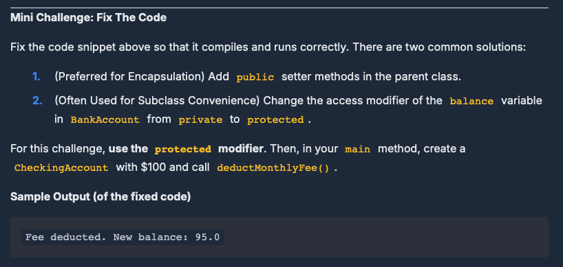
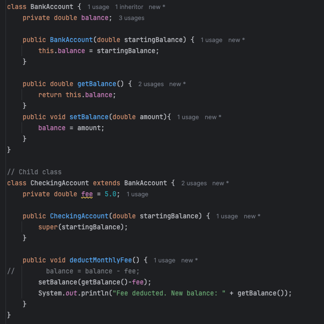
Solution: A setter to maintain encapsulation
- The protected access modifier may open up the balance to improper handling.
  - Additionally, we can keep the balance logic consolidated in the parent class for maintainability.

**Output:**
```text
Fee deducted. New balance: 95.0
```


